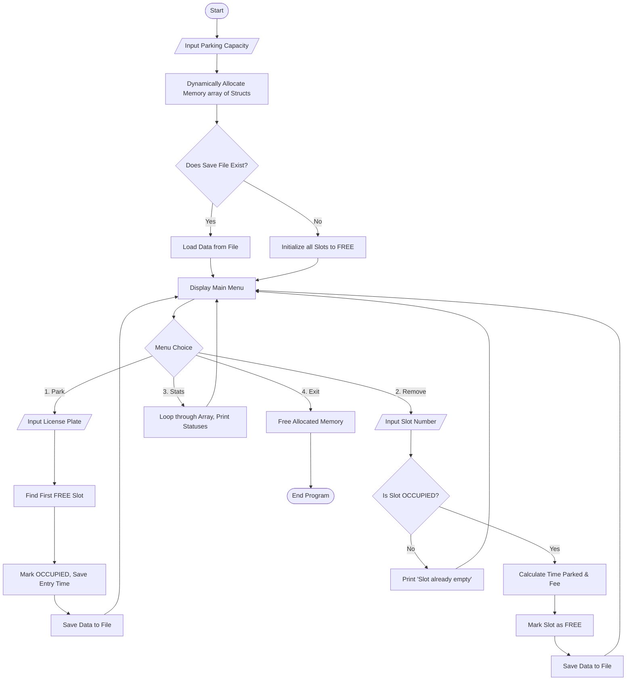

<div align="center">

**B.M.S COLLEGE OF ENGINEERING BENGALURU**
<br>Autonomous Institute, Affiliated to VTU

<br><br><br>

**SPC AAT Report on**

**TITLE**

**SMART PARKING MANAGEMENT SYSTEM**

<br><br>
Submitted in partial fulfillment of the requirements for AAT
<br><br>

**Bachelor of Engineering in**
<br>**ARTIFICIAL INTELLIGENCE AND DATA SCIENCE**

<br><br>

**Submitted by:**
<br>NAME OF THE CANDIDATE
<br>1) ANEL VIGNEASH REDDI P (1BM25AD002)
<br>2) SHREYAS K (1BM25AD54)

<br><br>

**Department of Artificial Intelligence and Data Science**
<br>B.M.S College of Engineering
<br>Bull Temple Road, Basavanagudi, Bangalore 560 019
<br>2025-2026

</div>

<div style="page-break-after: always;"></div>

<div align="center">

**B.M.S COLLEGE OF ENGINEERING**
<br>**DEPARTMENT OF ARTIFICIAL INTELLIGENCE AND DATA SCIENCE**

<br><br><br>

**DECLARATION**

</div>

We, Anel Vigneash Reddi P and Shreyas K students of II nd Semester, B.E, Department of AIDS, BMS College of Engineering, Bangalore, hereby declare that, this AAT Project entitled "SMART PARKING MANAGEMENT SYSTEM" has been carried out in Department of AIDS, BMS College of Engineering, Bangalore during the academic semester FEB 2025 – JUNE 2026. We also declare that to the best of our knowledge and belief, the AAT Project report is not from part of any other report by any other students.

<br><br>
**Student Name** &nbsp;&nbsp;&nbsp;&nbsp;&nbsp;&nbsp;&nbsp;&nbsp;&nbsp;&nbsp;&nbsp;&nbsp;&nbsp;&nbsp;&nbsp;&nbsp;&nbsp;&nbsp;&nbsp;&nbsp;&nbsp;&nbsp;&nbsp;&nbsp;&nbsp;&nbsp;&nbsp;&nbsp;&nbsp;&nbsp;&nbsp;&nbsp;&nbsp;&nbsp;&nbsp;&nbsp;&nbsp;&nbsp;&nbsp;&nbsp;&nbsp;&nbsp;&nbsp;&nbsp;&nbsp;&nbsp;&nbsp;&nbsp;&nbsp;&nbsp;&nbsp;&nbsp;&nbsp;&nbsp;&nbsp;&nbsp;&nbsp;&nbsp;&nbsp;&nbsp;&nbsp;&nbsp;&nbsp;&nbsp;&nbsp;&nbsp;&nbsp;&nbsp;&nbsp;&nbsp;&nbsp;&nbsp;&nbsp;&nbsp; **Student Signature** 
<br>1. Anel Vigneash Reddi P
<br>2. Shreyas K

<div style="page-break-after: always;"></div>

<div align="center">

**BMS COLLEGE OF ENGINEERING**
<br>**DEPARTMENT OF ARTIFICIAL INTELLIGENCE AND DATA SCIENCE**

<br><br><br>

**CERTIFICATE**

</div>

This is to certify that the AAT Project titled “SMART PARKING MANAGEMENT SYSTEM” has been carried out by Anel Vigneash Reddi P (1BM25AD002), Shreyas K (1BM25AD54) during the academic year 2025-2026.

<br><br><br><br><br>
**Signature of the Faculty in Charge**

<div style="page-break-after: always;"></div>

<div align="center">

**Table of Contents**

</div>

| Sl. No. | Title |
| :--- | :--- |
| 1 | Introduction |
| 2 | Algorithm |
| 3 | Flowchart |
| 4 | Source code |
| 5 | Results (screenshots) |
| 6 | References |

<div style="page-break-after: always;"></div>

<div align="center">

**1. INTRODUCTION**

</div>

As urban infrastructure expands and shopping malls experience high volumes of vehicular traffic, the management of parking facilities becomes a critical bottleneck. Traditional manual tracking of parking slots is error-prone, inefficient, and lacks proper data persistence. To better understand parking flow and reduce the chaos associated with finding parking spaces, automated management systems collect and manage parking data on a regular basis. 

The Smart Parking Management System is designed to manage and allocate parking space data efficiently. This system allows users to automatically find and allocate the nearest available parking slots and perform various operations on the collected data. The program automatically calculates important metrics such as time spent in the parking lot and dynamically computes the required parking fee, providing a clear overview of parking activity within a given dataset.

In addition to parking allocation, the system manages the state of the parking lot through file persistence. Data is saved directly to the hard drive, enabling the system to quickly recover and assess the status of each slot even after a power failure or system reboot. The program also counts the total number of occupied versus free slots and generates a summary report, making it easier to identify peak parking hours and manage capacity.

This project is implemented using the C programming language and demonstrates the practical application of fundamental programming concepts such as dynamic memory allocation (malloc/free), arrays, loops, conditional statements, structures (struct), enumerations (enum), pointers, and binary file I/O operations. The use of dynamically allocated arrays of structures enables highly scalable storage of parking data, while pointers and loops facilitate data analysis and automated allocation. The program provides a user-friendly, menu-driven console approach to handling complex data structures.

The Smart Parking Management System serves as an effective tool for educational purposes and advanced C programming implementation. It highlights the importance of pointers and memory management in developing scalable software and showcases how programming can be used to solve real-world infrastructure problems.

<div style="page-break-after: always;"></div>

<div align="center">

**2. ALGORITHM**

</div>

**Step 1:** Start the program and prompt the user to input the total maximum capacity of the parking lot.
**Step 2:** Dynamically allocate memory for an array of `ParkingSlot` structures based on the user's inputted capacity using the `malloc` function.
**Step 3:** Attempt to open `parking_data.dat` in binary read mode (`rb`) to load any previously saved parking state. If the file does not exist, initialize the lot by looping through the array and setting all slot statuses to `FREE`.
**Step 4:** Display the Main Menu with options: Park a Vehicle, Remove a Vehicle, View Statistics, and Exit.
**Step 5:** If the user selects "Park a Vehicle":
*   Input the license plate string.
*   Iterate through the array. Find the first slot where `status == FREE`.
*   Mark the slot as `OCCUPIED`, copy the license plate into the structure, and record the exact system entry time using `time(NULL)`.
*   Save the updated array to the binary file.
**Step 6:** If the user selects "Remove a Vehicle":
*   Input the slot number and validate that it is within the bounds of the capacity.
*   Check if the slot is `OCCUPIED`. If yes, record the exact exit time.
*   Calculate the total time parked using `difftime(exit_time, entry_time)`.
*   Calculate the total parking fee using a base rate and time multiplier.
*   Mark the slot as `FREE` and save the updated array to the binary file.
**Step 7:** If the user selects "View Statistics":
*   Iterate through the array and print the license plates of all `OCCUPIED` slots, and indicate all `FREE` slots.
*   Calculate and display the total number of occupied slots versus free slots.
**Step 8:** If the user selects "Exit":
*   Release the dynamically allocated memory back to the operating system using the `free()` function.
*   End the program.

<div style="page-break-after: always;"></div>

<div align="center">

**3. FLOWCHART**

</div>

*(Note: Paste the image of your flowchart here before printing the document)*



<div style="page-break-after: always;"></div>

<div align="center">

**4. SOURCE CODE**

</div>

### File 1: `parking.h`
```c
#ifndef PARKING_H 
#define PARKING_H

#include <time.h> 

typedef enum {
    FREE,
    OCCUPIED
} SlotStatus;

typedef struct {
    char license_plate[20]; 
    time_t entry_time;      
} Vehicle;

typedef struct {
    int slot_number;        
    SlotStatus status;      
    Vehicle parked_vehicle; 
} ParkingSlot;

void initialize_lot(ParkingSlot *lot, int capacity);
int park_vehicle(ParkingSlot *lot, int capacity, const char *plate);
void remove_vehicle(ParkingSlot *lot, int capacity, int slot_num);
void generate_statistics(const ParkingSlot *lot, int capacity);
void save_data(const ParkingSlot *lot, int capacity);
int load_data(ParkingSlot *lot, int capacity);

#endif 
```

### File 2: `parking.c`
```c
#include <stdio.h>   
#include <string.h>  
#include <time.h>    
#include "parking.h" 

void initialize_lot(ParkingSlot *lot, int capacity) {
    for (int i = 0; i < capacity; i++) {
        lot[i].slot_number = i + 1; 
        lot[i].status = FREE;       
    }
}

int park_vehicle(ParkingSlot *lot, int capacity, const char *plate) {
    for (int i = 0; i < capacity; i++) {
        if (lot[i].status == FREE) {
            lot[i].status = OCCUPIED; 
            strcpy(lot[i].parked_vehicle.license_plate, plate);
            lot[i].parked_vehicle.entry_time = time(NULL); 
            printf("\n=> Vehicle %s parked successfully in Slot %d.\n", plate, lot[i].slot_number);
            return 1; 
        }
    }
    printf("\n=> Sorry, the parking lot is completely FULL!\n");
    return 0; 
}

void remove_vehicle(ParkingSlot *lot, int capacity, int slot_num) {
    if (slot_num < 1 || slot_num > capacity) {
        printf("\n=> Invalid slot number!\n");
        return; 
    }
    int index = slot_num - 1;

    if (lot[index].status == OCCUPIED) {
        time_t exit_time = time(NULL); 
        double seconds_parked = difftime(exit_time, lot[index].parked_vehicle.entry_time);
        double fee = 5.0 + (seconds_parked * 2.0);

        printf("\n=> Vehicle %s is leaving Slot %d.\n", lot[index].parked_vehicle.license_plate, slot_num);
        printf("=> Time parked: %.0f units.\n", seconds_parked);
        printf("=> Total Fee: $%.2f\n", fee);

        lot[index].status = FREE;
    } else {
        printf("\n=> Slot %d is already empty!\n", slot_num);
    }
}

void generate_statistics(const ParkingSlot *lot, int capacity) {
    int occupied_count = 0;
    
    printf("\n--- Parking Lot Statistics ---\n");
    printf("Total Capacity: %d\n", capacity);

    for (int i = 0; i < capacity; i++) {
        if (lot[i].status == OCCUPIED) {
            occupied_count++;
            printf("Slot %02d: [OCCUPIED] - Plate: %s\n", lot[i].slot_number, lot[i].parked_vehicle.license_plate);
        } else {
            printf("Slot %02d: [  FREE  ]\n", lot[i].slot_number);
        }
    }
    
    printf("------------------------------\n");
    printf("Total Occupied: %d\n", occupied_count);
    printf("Total Free:     %d\n", capacity - occupied_count);
    printf("------------------------------\n");
}

void save_data(const ParkingSlot *lot, int capacity) {
    FILE *file = fopen("parking_data.dat", "wb");
    if (file == NULL) return;
    fwrite(lot, sizeof(ParkingSlot), capacity, file);
    fclose(file); 
}

int load_data(ParkingSlot *lot, int capacity) {
    FILE *file = fopen("parking_data.dat", "rb");
    if (file == NULL) return 0; 
    fread(lot, sizeof(ParkingSlot), capacity, file);
    fclose(file);
    return 1; 
}
```

### File 3: `main.c`
```c
#include <stdio.h>
#include <stdlib.h> 
#include "parking.h"

void clear_input_buffer() {
    int c;
    while ((c = getchar()) != '\n' && c != EOF) { }
}

int main() {
    int capacity;
    int choice;
    ParkingSlot *lot = NULL; 

    printf("=========================================\n");
    printf("   Welcome to Smart Parking Management   \n");
    printf("=========================================\n");

    printf("Enter the total capacity of the parking lot: ");
    while (scanf("%d", &capacity) != 1 || capacity <= 0) {
        printf("Invalid input. Please enter a positive number: ");
        clear_input_buffer(); 
    }
    clear_input_buffer(); 

    lot = (ParkingSlot *)malloc(capacity * sizeof(ParkingSlot));
    
    if (lot == NULL) {
        printf("CRITICAL ERROR: Memory allocation failed!\n");
        return 1; 
    }

    if (load_data(lot, capacity)) {
        printf("=> Previous parking data loaded successfully!\n");
    } else {
        printf("=> Starting with a fresh, empty parking lot.\n");
        initialize_lot(lot, capacity);
    }

    while (1) {
        printf("\n--- Main Menu ---\n");
        printf("1. Park a Vehicle\n");
        printf("2. Remove a Vehicle\n");
        printf("3. View Statistics\n");
        printf("4. Exit\n");
        printf("Enter your choice: ");

        if (scanf("%d", &choice) != 1) {
            printf("\n=> Invalid input! Please enter a number.\n");
            clear_input_buffer();
            continue; 
        }
        clear_input_buffer();

        switch (choice) {
            case 1: {
                char plate[20];
                printf("Enter License Plate: ");
                scanf("%19[^\n]", plate);
                clear_input_buffer();
                park_vehicle(lot, capacity, plate);
                save_data(lot, capacity); 
                break;
            }
            case 2: {
                int slot;
                printf("Enter Slot Number to remove vehicle from: ");
                if (scanf("%d", &slot) == 1) {
                    remove_vehicle(lot, capacity, slot);
                    save_data(lot, capacity); 
                } else {
                    printf("Invalid slot number format.\n");
                }
                clear_input_buffer();
                break;
            }
            case 3:
                generate_statistics(lot, capacity);
                break;
            case 4:
                printf("\n=> Saving data and shutting down. Goodbye!\n");
                free(lot); 
                return 0; 
            default:
                printf("\n=> Invalid choice! Please select 1-4.\n");
        }
    }

    return 0; 
}
```

<div style="page-break-after: always;"></div>

<div align="center">

**5. RESULTS (SCREENSHOTS)**

</div>

*(Note: Paste your actual terminal screenshots here before printing. Below is the expected output.)*

**Initialization Output:**
```text
=========================================
   Welcome to Smart Parking Management   
=========================================
Enter the total capacity of the parking lot: 20
=> Starting with a fresh, empty parking lot.

--- Main Menu ---
1. Park a Vehicle
2. Remove a Vehicle
3. View Statistics
4. Exit
Enter your choice:
```

**Parking Output:**
```text
Enter your choice: 1
Enter License Plate: KA-01-EE-5555

=> Vehicle KA-01-EE-5555 parked successfully in Slot 1.
```

**Statistics Output:**
```text
Enter your choice: 3

--- Parking Lot Statistics ---
Total Capacity: 20
Slot 01: [OCCUPIED] - Plate: KA-01-EE-5555
Slot 02: [  FREE  ]
Slot 03: [  FREE  ]
------------------------------
Total Occupied: 1
Total Free:     19
------------------------------
```

**Removal Output:**
```text
Enter your choice: 2
Enter Slot Number to remove vehicle from: 1

=> Vehicle KA-01-EE-5555 is leaving Slot 1.
=> Time parked: 120 units.
=> Total Fee: $245.00
```

<div style="page-break-after: always;"></div>

<div align="center">

**6. REFERENCES**

</div>

*   Brian W. Kernighan and Dennis M. Ritchie, The C Programming Language, 2nd Edition, Prentice Hall of India, New Delhi. 
*   E. Balagurusamy, Programming in ANSI C, 8th Edition, McGraw-Hill Education, India. 
*   Stephen Prata, C Primer Plus, 6th Edition, Addison-Wesley Professional. 
*   Yashavant Kanetkar, Let Us C, 17th Edition, BPB Publications, India. 
*   GeeksforGeeks, Dynamic Memory Allocation in C using malloc(), Available online: GeeksforGeeks malloc in C
*   GeeksforGeeks, Structures in C, Available online: GeeksforGeeks Structures in C 
*   TutorialsPoint, C Programming – File I/O, Available online: TutorialsPoint File I/O in C
*   cplusplus.com, C Standard Library Reference `<time.h>`, Available online: cplusplus.com Reference 
